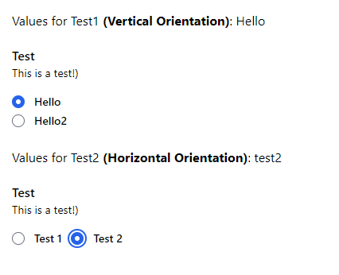

# TailBlazor.RadioButton


Blazor RadioButton is a basic yet customizable RadioButton component for Tailwindcss.

Without passing anything to it you will get a default radio color of `text-blue-500` and `focus:ring-blue-500`. If you would like to implement your own colour please add `radioButtonColor` into the theme section of your tailwind.config.js.

``` javascript
# tailwind.config.js
module.exports = {
    purge: {
    },
    darkMode: false, // or 'media' or 'class'
    theme: {
        extend: {},
        colors: {
            radioButtonColor: 'your colour of choice'
        }
    },
    variants: {
    extend: {},
    },
    plugins: [
        require('@tailwindcss/forms')
    ],
}
```

### **Important**:

This package requires tailwindcss/forms for certain styles, please install it from npm:

``` npm
# Using npm
npm install @tailwindcss/forms

# Using Yarn
yarn add @tailwindcss/forms
```



## Getting Setup

You can install the package via NuGet package manager just search TailBlazor.RadioButton. You can also install via powershell using the following command:

``` Install-Package TailBlazor.RadioButton ```

or via the dotnet CLI:

``` dotnet add package TailBlazor.RadioButton ```

### 1. Add Imports

Add line to your _Imports.razor

``` @using TailBlazor.RadioButton ```

### 2. Create a RadioButton component

Simply open up a component and add your content.

``` C#
<RadioButtonGroup>
    <RadioButtonGroupLabel Label="Values" SubLabel="Sublabel for values!"></RadioButtonGroupLabel>
    <RadioButtonGroupContainer GroupName="values" @bind-Value="value" TValue="string">
        <RadioButton InputId="value1" Label="Value 1" Value="@("Value1")" TValue="string"></RadioButton>
        <RadioButton InputId="value2" Label="Value 2" Value="@("Value2")" TValue="string"></RadioButton>
    </RadioButtonGroupContainer>
</RadioButtonGroup>

@code {
    string value = "";
}
```

If you would like to add custom content for the ```<RadioButton />``` component, then instead of giving it the values you can just enter your custom content as such:

``` C#
<RadioButton>
    <input type="radio" id="value3" value="Value3" name="@(context.GroupName)" @onchange="@(() => { context.SetCurrentValue("Value3"); })" />
    <label for="test3">Value 3</label>
</RadioButton>
```

or you can add your custom content inside the ```<RadioButtonGroupContainer />`` as well:

``` C#
<RadioButtonGroupContainer GroupName="values" @bind-Value="value" TValue="string">
    ... Custom Content ...
</RadioButtonGroupContainer>
```

**NOTE: You must specify the TValue for each ```<RadioButton />``` component or else the compile will fail, this is unfortunately a limitation of Blazor.**

### 3. (Optional) Creating a RadioButton component via a list

If you would like to simply the creation of these radio buttons, then you can also pass a list over to the ```<RadioButtonGroupContainer />``` component and it will be created automatically off the list.

``` C#
<RadioButtonGroup>
    <RadioButtonGroupLabel Label="Values" SubLabel="Sublabel for values!"></RadioButtonGroupLabel>
    <RadioButtonGroupContainer GroupName="values" @bind-Value="value" TValue="string" Items="items"></RadioButtonGroupContainer>
</RadioButtonGroup>

@code {
    string value = "";

    List<RadioItem<string>> items = new List<RadioItem<string>>()
    {
        new RadioItem<string>{ Id = "value1", Text = "Value 1", Value = "value1" },
        new RadioItem<string>{ Id = "value2", Text = "Value 2", Value = "value2" }
    };
}
```

### 4. (Optional) Using a callback instead of bind-Value

If you would like to utilize a callback function instead of using the default bind-Value, then you can exchange that with ValueChanged:

``` C#
<RadioButtonGroupContainer GroupName="values" ValueChanged="@((value) => { yourFunction(); })" TValue="string"></RadioButtonGroupContainer>
```

## Components

### ```<RadioButtonGroup>```

This is just the main `<fieldset></fieldset>` container.

Parameter | Type | Default Value | Description
--- | --- | --- | ---
`Id` | `String` | `N/A` | The id for the group.
`Class` | `String` | `N/A` | The class for the group.
`ChildContent` | `RenderFragment` | `N/A` | The child content of the group.

### ```<RadioButtonGroupLabel>```

This is nothing but the main header for the radio button group. This is **NOT** the same as ```<label>``` for the specific input.

Parameter | Type | Default Value | Description
--- | --- | --- | ---
`Class` | `String` | `text-base font-medium text-gray-900` | The class for the group label. This will override any default classes.
`Label` | `String` | `N/A` | The label text.
`SubLabel` | `String` | `N/A` | The sub label text, goes underneath the main label.
`SubLabelClass` | `String` | `text-sm text-gray-500` | The class for the sub label. This will override any default classes.

### ```<RadioButtonGroupContainer>```

This is main container for all the radio buttons.

Parameter | Type | Default Value | Description
--- | --- | --- | ---
`Value` | `TValue (typeparam)` | `N/A` | The value that we are binding to.
`Class` | `String` | `N/A` | The class for the container div. This will override any default classes.
`Orientation` | `RadioButtonOrientation` | `RadioButtonOrientation.Vertical` | The orientation that we would like to set these radio buttons.
`GroupName` | `String` | `N/A` | The group name for all the radio buttons that get created.
`Items` | `List<RadioItem<TValue>>` | `N/A` | A list of RadioItems so that we can automatically create the radio buttons.
`ValueChanged` | `EventCallback<TValue>` | `N/A` | A callback function for any customization when a value changes.
`ChildContent` | `RenderFragment<RadioButtonGroupContainer<TValue>>` | `N/A` | The child content.

The ```<RadioButtonGroupContainer />``` has a public function SetCurrentValue(TValue value), which will set the Value parameter for the component, this can be used when using custom input elements, otherwise it is done automatically for you.

### ```<RadioButton>```

This is a container that holds the ```<input type="radio" />``` and ```<label />``` elements. You can also override the content.

Parameter | Type | Default Value | Description
--- | --- | --- | ---
`InputId` | `String` | `N/A` | The id of the radio input.
`InputClass` | `String` | `focus:ring-blue-500 focus:ring-radioButtonColor h-4 w-4 text-blue-600 text-radioButtonColor border-gray-300` | The class for the radio input. This will override any default classes.
`LabelClass` | `String` | `ml-3 block text-sm font-medium text-gray-700` | The class for the label for the radio input. This will override any default classes.
`Label` | `String` | `N/A` | The label text.
`Value` | `String` | `N/A` | The value of the input.
`ChildContent` | `RenderFragment<RadioButtonGroupContainer<TValue>>` | `N/A` | The custom content, if not using the pre-made content.

## Enums

### ```RadioButtonOrientation```

Parameter | Class
--- | ---
`Vertical` | `flex flex-col`
`Horizontal` | `flex flex-col`

## Models

### ```RadioItem<TValue>```

The TValue in this case will be whatever you want the Value parameter to be.

Parameter | Type | Description
--- | --- | ---
`Id` | `String` | The id for the ```<input />``` element.
`Text` | `String` | The label text.
`Value` | `TValue` | The value for when the radio button is selected.
